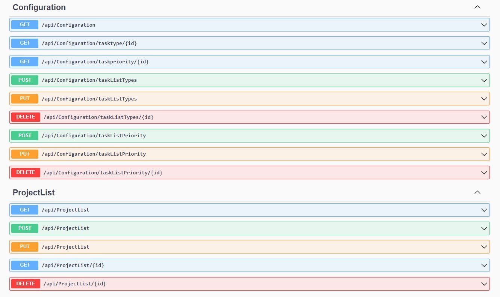
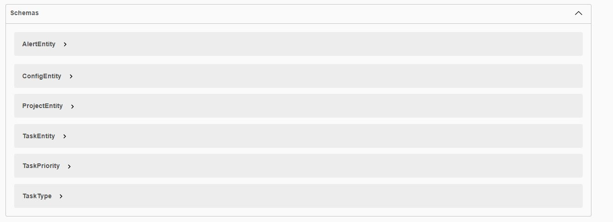

# SmartWorks: A Customized Project Management System for Mechanical Designers

A custom-made project management application for small and medium-sized businesses, focused on mechanical designers. This application provides a dashboard with the next items:

# Inspiration for the Project

Working on complex machinery projects can become chaotic when you are managing multiple projects at the same time. I think that having a centralized, intuitive place to access all necessary project information would eliminate issues such as misunderstandings, forgotten documentation, lost project status, and the need to constantly review everything every 3-4 weeks. This project was inspired by the desire to streamline and simplify the project management process for mechanical designers.

# Features

- On the left, a list of projects where the logged designer is working.
- and a list of highest priority tasks of the projects where the designer is working.
- On the right side, alerts that the designers or project managers can use to share important information
- a calendar area with 2 or 3 months with the week number too, in that way can the designer estimate times during a phonecall or thinking about delivery times.

## Technologies

- React (for building the web application)
- JSON (for data storage and retrieval (old version))
- .NET 6 (server API REST)

### Future developments

- In addition, I'm developing the option of adding a real-time communication system or chat feature for designers and project managers to collaborate and share information.
- I have also suggested the possibility of adding a notes section where users can write ideas or comments about projects, like general data.
- Inside of each project I'm thinking about the option of implementing a order list section in the application, where users can track their orders or where the designer generates the bill of materials (BOM) using a csv file loaded from the app, and we have mentioned the possibility of downloading a PDF file with the list of requests or creating the PDF file on the fly when a quote is requested.
- In addition, I would like to have the option of having a specific page where users can view and edit project information, such as project status and deadlines.

## Future Technologies

- Real-time communication or chat feature, such as Socket.io or WebSockets
- PDF generation library, such as pdfmake or jsPDF, for creating PDF files on the fly
- CSV parsing library, such as PapaParse, for processing CSV files for the BOM feature

### Data

The projects in the JSON file look like this:

```json
{
  "id": "prj-1",
  "projectNumber": 1205,
  "description": "Rundschlinge Automat",
  "customer": "Arno Fita GbmH",
  "estate": "in Konstruktion",
  "isActive": true,
  "designer": "USER 1",
  "alert_list": [
    {
      "id": "alt-1",
      "description": "Alert Test 1. Änderung Standard Zeichung Montageplatte Pneumatik",
      "date": "11.12.2022 10:15",
      "type": "Änderung",
      "user": "USER 1",
      "projectNumber": 1205
    }
  ],
  "task_list": [
    {
      "id": "tsk-1",
      "description": "Fehler in der Grundplatte für Station 4 gefunden. Es soll geändert werden",
      "date": "11.12.2022 10:44",
      "type": "Änderung",
      "priority": 1,
      "user": "USER 1",
      "projectNumber": 1205
    },
    {
      "id": "tsk-2",
      "description": "Kollision zwischen Station 1 und Station 2",
      "date": "13.12.2022 10:33",
      "type": "Prüfung",
      "priority": 2,
      "user": "USER 2",
      "projectNumber": 1205
    },
    {
      "id": "tsk-3",
      "description": "Terminplan an Kunde zukommen lassen",
      "date": "15.12.2022 09:22",
      "type": "Dokumentation",
      "priority": 1,
      "user": "MANAGER",
      "projectNumber": 1205
    }
  ]
}
```

## API REST

This project uses a RESTful API for handling the communication between the frontend and the database. The API is built using the ASP.NET Core framework and utilizes the Repository pattern for interacting with the data.

<p align="center">
  
</p>
<p align="center">
  
</p>

### Endpoints

The following endpoints are available for interacting with the data:

- GET /api/configuration: Returns the configuration object in the database.
- GET /api/configuration/tasktype/{id}: Returns a specific task type with the given ID.
- GET /api/configuration/taskpriority/{id}: Returns a specific task priority with the given ID.
- POST /api/configuration/taskListTypes: Creates a new task type in the configuration object. The request body must contain a JSON object representing the task type.
- PUT /api/configuration/taskListTypes: Updates a specific task type in the configuration object. The request body must contain a JSON object representing the updated task type.
- DELETE /api/configuration/taskListTypes/{id}: Deletes a specific task type with the given ID.
- POST /api/configuration/taskListPriority: Creates a new task priority in the configuration object. The request body must contain a JSON object representing the task priority.
- PUT /api/configuration/taskListPriority: Updates a specific task priority in the configuration object. The request body must contain a JSON object representing the updated task priority.
- DELETE /api/configuration/taskListPriority/{id}: Deletes a specific task priority with the given ID.

- GET /api/projects: Returns a list of all projects in the database.
- GET /api/projects/{id}: Returns a specific project with the given ID.
- POST /api/projects: Creates a new project in the database. The request body must contain a JSON object representing the project.
- PUT /api/projects/{id}: Updates a specific project with the given ID. The request body must contain a JSON object representing the updated project.
- DELETE /api/projects/{id}: Deletes a specific project with the given ID.

## Installation and Usage

1. Clone the repository
2. Run `npm install` to install dependencies
3. Run `npm start` to start the application

## Contribution

If you would like to contribute to the project, please submit a pull request with your changes.

# Contact

For any questions or suggestions about the project, please email the development team at hugomartin.menz@gmail.com
